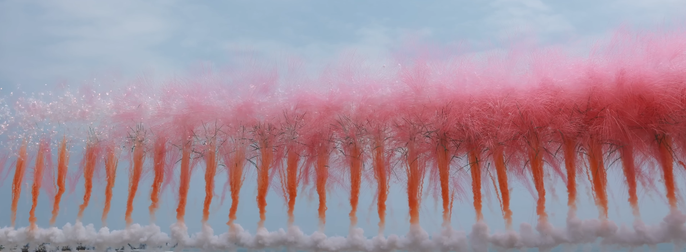
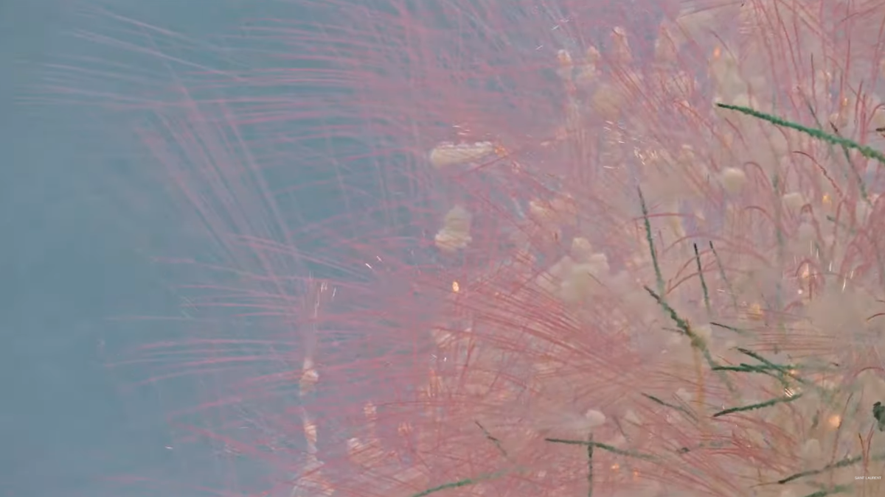
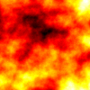

# yuli0586_9103_Tut2

# Quiz 8
## Part 1: Imaging Technique Inspiration
### Inspiration Source
My inspiration comes from Cai Guo-Qiang’s gunpowder fireworks in the Saint Laurent art film. The “imaging technique” here refers to the unique way visual forms are created and captured—through physical explosion, layered smoke, scattered particles, and unfolding sequences in the sky. I am especially inspired by the transformation from a concentrated firework burst into branching forms that resemble natural growth or blooming—creating a dramatic, evolving image.

[Watch the inspiration video on YouTube](https://www.youtube.com/watch?v=I2uIi0GT8Qg&ab_channel=SaintLaurent)

  

### How This Inspires My Project
I want to borrow the imaging logic in Cai Guo-Qiang’s fireworks—the process of visual expansion from focused bursts into layered forms. This helps me animate *Ntange II (Grass)* by translating its dots and lines into growing, branching particles with dynamic timing and colour variation. The technique’s visual layering and motion echo the complexity and rhythm in the original painting. It fits the assignment goal because it allows me to abstract the painting using Perlin noise and randomness, creating a generative system that evolves over time—matching the requirement to animate the group artwork in a personal, expressive way.

## Part 2: Coding Technique Exploration
I use **Perlin noise** to drive smooth, organic animation in my reinterpretation of *Ntange II (Grass)*. Inspired by the expanding motion of fireworks, I apply Perlin noise to control particle movement and simulate drifting grass or sparks that unfold from a central burst. Unlike simple randomness, Perlin noise creates natural transitions that evolve over time, adding rhythm and coherence to the animation. This technique is ideal for abstracting the original painting into an expressive and generative digital form.

Example Screenshot:  

Code and Visual Examples:
- [Coding Train – Perlin Noise Particle Flow](https://editor.p5js.org/codingtrain/sketches/2_hBcOBrF)
- [Matlab Example – Fire Effect from Perlin Noise](https://www.mathworks.com/matlabcentral/answers/1778815-creating-video-fire-effect-from-perlin-noise)
- [Detailed Explanation of Perlin Noise Algorithm](https://rtouti.github.io/graphics/perlin-noise-algorithm)
